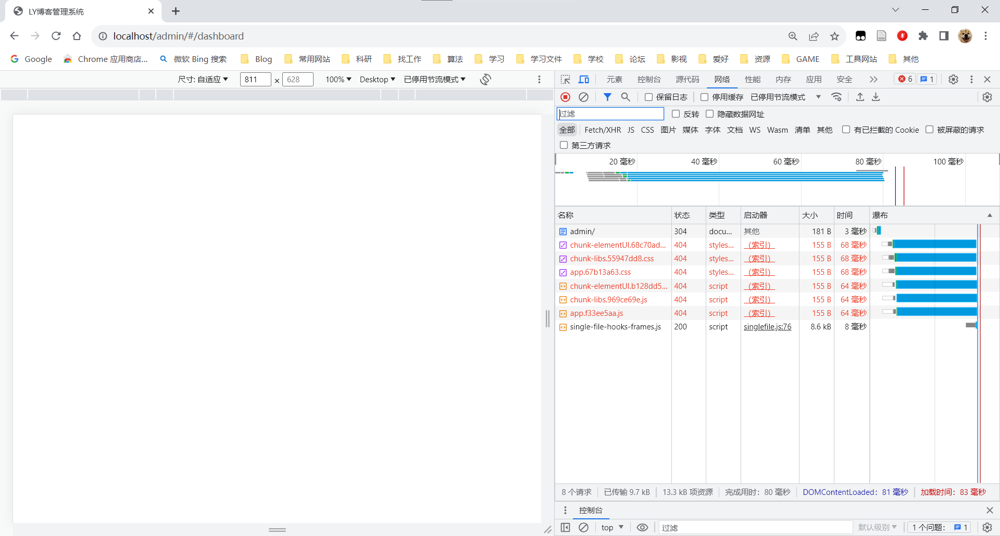
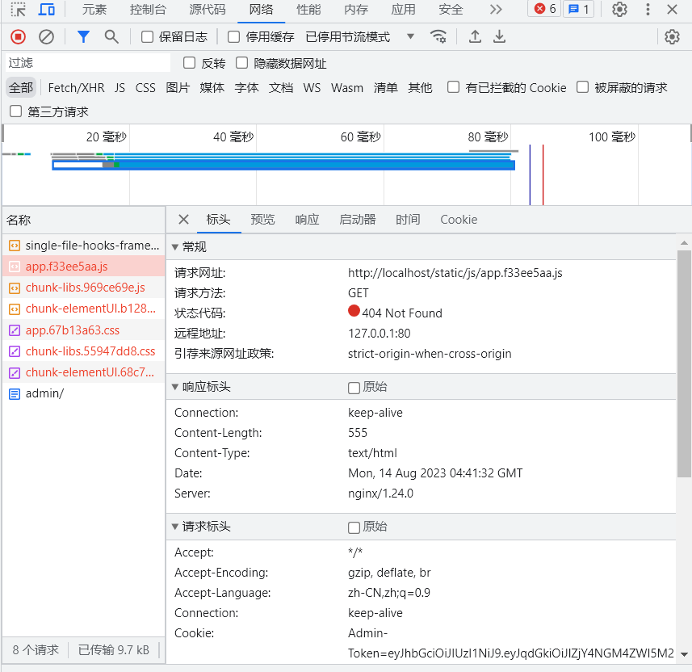
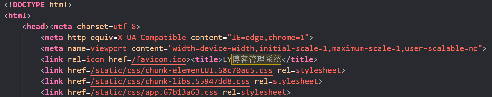
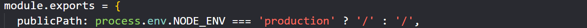
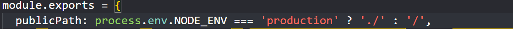
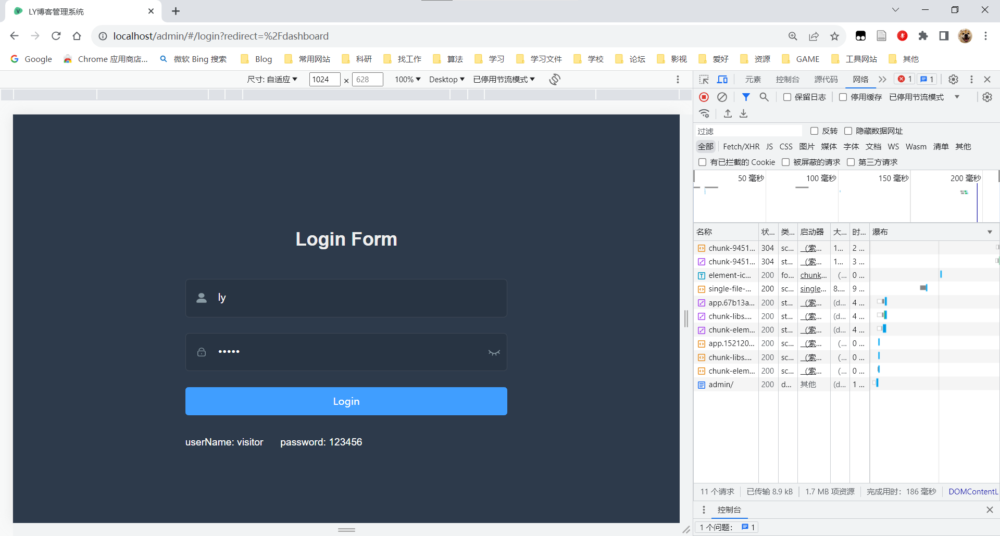

# 问题解决1：nginx反向代理丢失js、css问题

> 通过 `http://公网ip:端口号` 访问到博客前端，此时，假设我们要上线，端口暴露着实不好看，我们希望是类似`http://公网ip/页面名/`这样的格式进行访问项目，看着比较舒服，这样怎么做呢？

#### 1. 使用nginx的反向代理

```cpp
server {
    listen       80;
    server_name  localhost;
    location /页面名 {
        proxy_pass   http://公网ip/;
        #转发请求头设置
        proxy_set_header Host $proxy_host;
        proxy_set_header X-Real-IP $remote_addr;
        proxy_set_header X-Forwarded-For $proxy_add_x_forwarded_for;
    }
}
```

> 看似这种方法直接就解决了这个痛点问题，这个配置文件的含义就是将/页面名的请求转发到目标端口上，十分完美，我们重启nginx试一下效果：



> 哦吼，js、css文件都找不到了



image.png

> 我们发现，项目中的静态文件为啥都直接去根目录去找呢？问题出在打包的配置文件上：
> 我们本地执行打包命令`npm build:prod`，然后去根目录的dist文件夹中查看index.html文件，发现下面的情况：



> 发现所有的外部文件都是去根目录开始的，这就会产生上面的问题。

#### 2. 解决产生的问题

> 解决问题肯定是去整理刚才的路径，我们这里修改配置文件中的`发布路径`

对于新版本的vue，需要新增vue.config.js，并添加如下配置，产生的效果是一样的

修改前：



修改后



> 此时，部署前端到nginx，运行，查看效果，成功。

